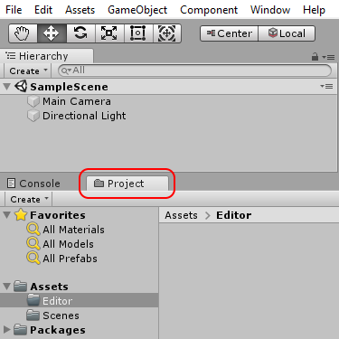
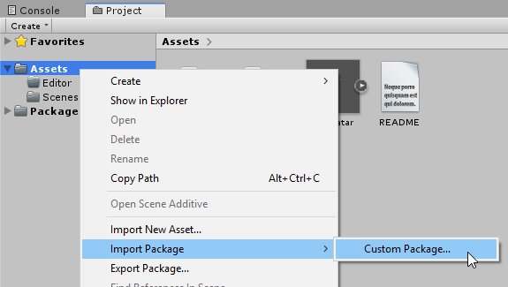
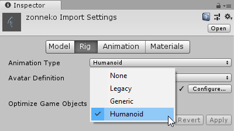
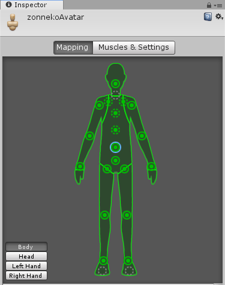
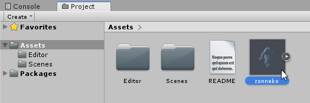
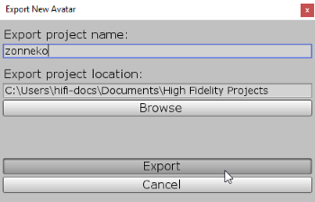
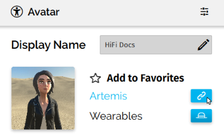

The High Fidelity Avatar Exporter for Unity (also known as the "avatar exporter") automatically packages your avatar for use in High Fidelity. This tool lets you import most avatars into Unity, map their skeleton using Unity's humanoid tool, and export them as FST and FBX files to import in-world. 

High Fidelity supports only one standard type of rigging for avatars. This tool can be used when your avatar is rigged differently from our standard. Keep in mind that this tool will only work for human-like avatars that have the same basic structure representing parts of the body, head, and limbs. 

>>>>>The avatar exporter was written to improve the process of rigging and mapping the skeleton rig. This will not affect the animations or materials in your avatar. To adjust the animations or materials, you will need to use a 3D modelling tool such as Blender or Maya and make modifications to your avatar prior to using the avatar exporter in Unity.

You will need the following to use this tool: 
+ Unity (Minimum recommended version: 2017.4.17f1)
+ High Fidelity (v0.77.0 or higher)
+ [High Fidelity Avatar Exporter for Unity](https://github.com/highfidelity/hifi/raw/master/tools/unity-avatar-exporter/avatarExporter.unitypackage)

## Avatar Guidelines

Many external sites like TurboSquid and CGTrader provide avatars that you can use. You can use avatars downloaded from these sites according to their terms of use. However, many of these may not work in High Fidelity. Be sure to find an avatar that fits these guidelines: 

* [Real-time models](https://blog.turbosquid.com/real-time-models/) (not rendered)
* Rigged avatars
>>>>>If your avatar is not rigged, you can use [Mixamo](../mixamo-tutorial) to rig it. If you use Mixamo, you do not necessarily need to use Unity and the avatar exporter. You can also use [our avatar packager](../../package-avatar) to get your avatar ready to import into High Fidelity. 
* Avatars in the FBX file format (we don't enforce a poly count limit, but we recommend using an avatar with a low poly count of around 10k)

## Create a Unity Project

1. Launch Unity. 
2. On the Home screen, click New. 
3. Enter a Project name and Template. Your models should be 3D. 
4. Click Create project. 

## Install the High Fidelity Avatar Exporter for Unity

>>>>>You need to install the extension for each Unity project that you have. Keep in mind, however, that you can import and export multiple avatars in a single Unity project.  

1. Download the [avatar exporter](https://github.com/highfidelity/hifi/raw/master/tools/unity-avatar-exporter/avatarExporter.unitypackage) from High Fidelity. 
2. In Unity, open the Project window at the bottom.
3. Right-click the Assets folder, then select Import Package > Custom Package. 
4. Navigate to the `avatarExporter` package (with a .unitypackage extension). Click Open. You can also double-click the package on your computer to import it automatically.
5. In the Importing Package window, review the list of files to be imported and check for conflicts with files already in your project. If a conflict exists, save any local changes somewhere outside of your project.
6. Click Import. The package's files are added to the Assets folder. You should now have a High Fidelity menu in Unity. 

## Create an Avatar Package

1. You can import the FBX model for your avatar into Unity using any of the following methods:
   + Drag and drop the FBX file into the Assets folder of your Project window.
   + In the Project window, right-click the Assets folder, then select Import Package > Import New Asset. Navigate to the FBX file and click Import.
   + In Unity, open the Assets menu, then select Import Package > Import New Asset. Navigate to the FBX file and click Import.
2. In the Project window, select your avatar’s FBX file. In the Inspector, open Rig. For Animation type, choose Humanoid and then click Apply. 
3. Click Configure to investigate and tweak the mapping of your avatar.  
4. All bones mapped in Unity are highlighted in green and can be selected. Check if anything is missing. Any errors will appear in red. The minimum required bones for mapping are Hips and Spine. If either of these are missing, you must manually add bones before continuing. 
>>>>>Avatars in High Fidelity must also have a Chest bone. If your avatar does not have a chest bone, the avatar exporter attempts to map another existing bone to the Chest. If we can't find a suitable Chest bone and Humanoid didn't correctly map Chest, then you will get an error and need to manually add a Chest bone to your skeleton.
5. If you made any changes, click Done. 
6. Click on the FBX file in the Assets manager. 
7. Make sure that you have the [avatar exporter](#install-the-high-fidelity-avatar-exporter-for-unity) installed. Open the High Fidelity menu in the top menu bar, then select Export New Avatar.
8. Give your avatar project a name. The default project location is your local user's `Documents\High Fidelity Projects` directory, which is created automatically for you. Though we recommend that you keep your avatars in this directory, you can change it to another location on your computer. 
9. Click Export. 

Your avatar package has been created! The File Explorer will open to your new avatar project.

>>>>>If you are using any external textures with your avatar model, please copy those textures to your local user's `Documents\High Fidelity Projects\avatar\<project name>\textures` directory. Otherwise, they will not show up on your avatar in High Fidelity. We support textures in either PNG or JPG format.

## Test Your Avatar

Test your avatar locally before you host and use it. This step lets you check your avatar for any issues and fix them before you host it online. 

>>>>>Using these steps will not actually change your avatar in the metaverse, and should only be used for testing. If you want to change your avatar to something others can see, you need to first publicly [host your avatar](../../host-avatar) before you can [use your custom avatar](../../change-avatar#use-your-own-custom-avatar). 

1. Copy your avatar's textures into the project’s textures folder. We support textures in either PNG  or JPG format.
2. Go to the folder where your avatar project is saved on your computer. Right-click the FST file and click copy. This will copy your FST file’s local path.
3. In Interface, pull up your tablet or HUD and click on Avatar.
4. In the Avatar window, click the link icon next to your current avatar. Paste the copied FST file's URL and click Confirm.
5. Test your avatar by moving around and using the **Emote** app.

If something doesn't look right, you can tweak your avatar in Unity, then update it with the High Fidelity menu. If everything looks good, you need to [host your avatar](../../host-avatar) then [change the URL](../../change-avatar#use-your-own-custom-avatar) to point to your hosted version.

### Troubleshooting Tips

Use these troubleshooting tips if you notice any issues while packaging or testing your avatar:

| Issue                                                     | Troubleshooting Tip                                          |
| --------------------------------------------------------- | ------------------------------------------------------------ |
| You receive a warning in Unity: "Character is not in T pose." | This will not affect the results, and the avatar exporter can still be used. You can safely ignore this warning. |
| You receive an error when exporting your avatar: "There is no &lt;Chest &vert; Spine &vert; Hips> bone in the selected avatar." | Avatars in High Fidelity must have a minimum of 3 bones: the hips, spine and chest. This error will occur if one or more of these bones are either a) incorrectly mapped by Unity or b) missing in your skeleton. 
If the bone is incorrectly mapped, [open the Humanoid mapping](#mesh) using the Configure button. In the Avatar Configuration hierarchy, locate the matching bones and drag them into the Humanoid mapping to manually assign the bone mappings. 
If the bones do not actually exist in the model, you need to modify the model outside of Unity to add missing bones.  |
| Your avatar is gray.                                      | One of two issues could have occurred:  A) Make sure you copied your avatar's textures into the project’s textures folder   B) Verify that your textures are in a format that we support (either PNG or JPG) |
| Your avatar is too small or too big.                      | In Interface, go to the **Avatar** app and click on the settings icon. Move the Avatar Scale slider between 0.1x to 4x to make it smaller or bigger. 
If that isn't sufficient, you can manually change the scale in your avatar's FST file in a text editor. Keep in mind that any changes to the scale will work only after using the packager, as the packager overwrites these changes. |
| Your avatar is tied up into knots or laying down.                      | This could mean that your skeleton is not right. Re-open your avatar in Unity and run through steps 2-5 of [Create an Avatar Package](#create-an-avatar-package) again. Update your project in Unity (go to High Fidelity menu > Update Existing Avatar, then browse to your avatar package). 
If it still doesn't work, ensure that you are testing the correct file that the avatar exporter created. |
| Your avatar's skin doesn't move properly with animations. |  The avatar exporter was written to improve the process of rigging and mapping the skeleton rig. This will not affect the animations in your avatar. To adjust the animations, you will need to use a 3D modelling tool such as Blender or Maya and fix the skin weighting on the avatar prior to using the avatar exporter in Unity.  |

