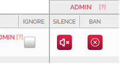
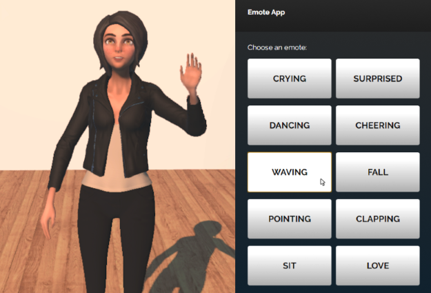
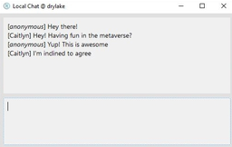
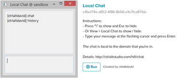
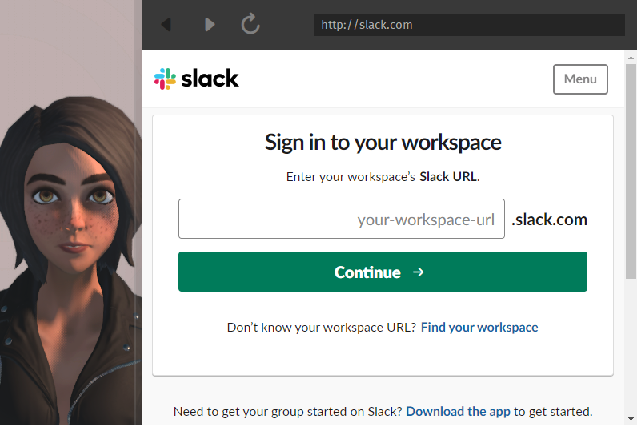

High Fidelity is all about the people you meet and the experiences you have with them. High Fidelity enables people connected by interest, community, and friendship to come together from anywhere in the world.

**On This Page:**
* [Make Connections and Friends](#make-connections-and-friends)
    * [The People App](#the-people-app)
    * [Your Privacy Bubble](#your-privacy-bubble)
* [Attend Live Events](#attend-live-events)
* [Express Yourself](#express-yourself)
    * [The Emote App](#the-emote-app)
* [Chat with Users](#chat-with-users)
    * [HiFi Local Chat](#hifi-local-chat)
    * [COM Script Version 1](#com-script-version-1)
<!--    * [Run External Chap Apps in Local Browser](#run-external-chat-apps-in-local-browser) -->

## Make Connections and Friends

In High Fidelity, you can establish a connection with someone else by shaking hands with them. With your hand controllers, place your hands near each other and hold the grip button. Desktop users can press and hold <kbd class="keyboard">X</kbd> on their keyboard. 

Once you make a connection with someone, they will appear under Connections in the [**People** app](#the-people-app). You will also appear on their list of connections. You will be able to see where they are in the metaverse, and you can travel to them at any time. 

To mark a connection as a friend, check the box next to their name in the People app. You can make yourself available to only your friends using the People app. 

### The People App

The People app provides a set of tools that help users manage their interactions with people in the metaverse. It gives you a list of the people nearby (in the same domain as you), and gives you easy access to all of your connections. From the People app, you can: 

| Feature          | Description                                                  |
| ---------------- | ------------------------------------------------------------ |
| Profile Picture  | This is where your profile picture will be visible. Click on the image to view your profile. You can change this image on our [website](https://highfidelity.com/). |
| Display Name     | You can change your display name at any time. By default, it will be 'anonymous'. In the image above, the display name is 'HiFi Docs'. |
| Set Availability | This feature allows you to appear online to select groups of users: Everyone, Friends and Connections, Friends Only, or Appear Offline. The users you appear online to will also be able to teleport to your location. |
| Master Volume    | Set the volume of your audio in High Fidelity.               |
| Nearby           | This is the list of users who are nearby in the same domain as you. |
| In View          | You can check this box to view only the users in front of you in a domain. This is useful when a domain has a lot of users. |
| Refresh Button   | Click this button to refresh the list of users currently in the domain. |
| Connections      | This is the list of users who are your friends and connections. You can also teleport to their location from this list. |
| Loud             | Click this icon next to the user you want to mute. The user will be muted only for you, not for other users in the domain. The icon also displays how loudly a user is speaking. |
| Names            | This is the list of users available in the domain. You will only see their display names. |
| Ignore           | If you check this box next to a user, you and the user will not be able to see or hear each other. |

#### Use the People App as an Admin

As an administrator in a domain, you will have privileges to maintain a domain. The People app will have an additional column that allows an admin to silence and ban users in the same domain.

| Feature | Description                                                  |
| ------- | ------------------------------------------------------------ |
| Silence | You can click the icon to mute a user. This user will be muted for everyone in the domain. |
| Ban     | You can click here to ban a user from the current domain. The user will not be able to enter the domain using the same account. The banned user will still have access to other High Fidelity domains. |

### Your Privacy Bubble

You can enable a privacy bubble that protects your personal space in the metaverse. When it is enabled, other people will disappear if they get too close to you. Your privacy bubble is disabled by default. To enable it, pull up your tablet or HUD and click **Bubble**.

## Attend Live Events

One of the great things about virtual reality is that you can attend events. High Fidelity regularly hosts events such as workshops, lectures on VR, and town hall meetings to meet our team. Click here to [view all upcoming events](https://tockify.com/hifieventscalendar/agenda). Events are a great place to meet others and share experiences with others around the world.

To attend an event, simply go to the hosted domain at the time of the event.

## Express Yourself

There are many ways you can express yourself in High Fidelity, such as animating the mouth of your avatar or using gestures in the **Emote** app. 

By default, all avatars will use a standard set of animations, such as your eyes blinking or your mouth opening and closing as you talk. When you are using a VR controller, your avatar will automatically mimic your hand gestures and movements. 

### The Emote App

The Emote app is a way for desktop users to express themselves without using VR controllers. With this app, you can display feelings by: crying, acting surprised, dancing, cheering, waving, falling, pointing, clapping, sitting, or showing love. 

## Chat with Users

High Fidelity doesn't yet have a default text chat option that works well for both HMD and desktop users as most HMD users can't type easily. Our extensible open-source scripting and UI gives you the ability to create the features you want, including text chat. There are some great scripts for chat that have already been built by community members, and a few are described below.

### HiFi Local Chat 

This clean, reliable, and well-written chat script was created by alpha user ctrlaltdavid. 

To run the script:

1. In Interface, go to **Edit > Open and Run Script from URL**.
2. Paste the URL [http://ctrlaltstudio.com/downloads/hifi/scripts/chat.js](http://ctrlaltstudio.com/downloads/hifi/scripts/chat.js).

The script will start running and display a text chat window pop-up. You can use this window to chat with other users in the same domain who are running the same script. If text chat is important to you, you can add this to your default scripts so it’s always there.

### COM Script Version 1

AlphaVersionD has authored an equally powerful and friendly script that runs on a domain. All users that visit a domain with the script can chat with one another, without installing a separate app or script. With this script, you have the power to enable chat on any of your own domains.

>>>>> You can run a script only in a domain where you have the right permissions. Ensure that you have the right permissions in a domain where you wish to use the COM Script.

To install COM Script in your domain:

1. In Interface, pull up your HUD or Tablet and go to **Create**. 
2. Click the 'zone' icon to create a zone entity.
3. In the 'Properties' tab of the zone entity, paste the URL [http://metaversecafes.com/HighFidelity/QueenCity/A_2016_Q_wab/AQUI/COM_v1.0.js](http://metaversecafes.com/HighFidelity/QueenCity/A_2016_Q_wab/AQUI/COM_v1.0.js).

COM Script version 1 is now running in the zone in your domain!

<!--
### Run External Chat Apps in Local Browser

You can also use external browser-based chat applications of your choice in High Fidelity, such as Whatsapp, Slack, or Google Talk. To do this: 

1. Launch a local web browser in High Fidelity by pressing <kbd class="keyboard">Ctrl</kbd> + <kbd class="keyboard">B</kbd>.
2. Run the external chat app of your choice and log in. 

This option works great, both for Desktop users and HMD users. While it might not be ideal for random chat encounters, it can be quite handy when larger groups (like colleagues and classmates) need a way to keep in touch without breaking immersion.

-->

**See Also**

+ [Bank and Shop](../bank-and-shop)
+ [Tutorial: Transfer Money and Items](../../script/transfer-hfc-tutorial)
+ [Give and Receive Gifts](../gifts)
