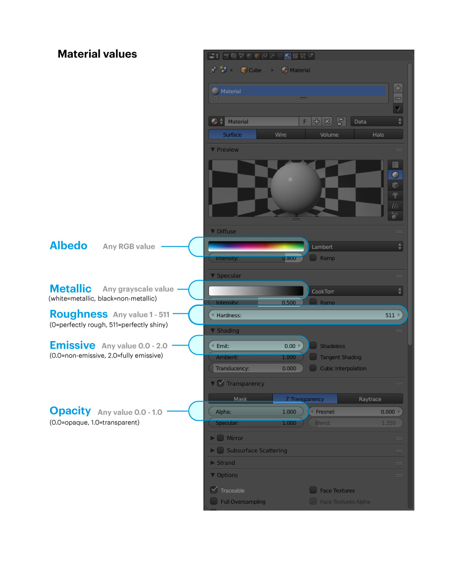
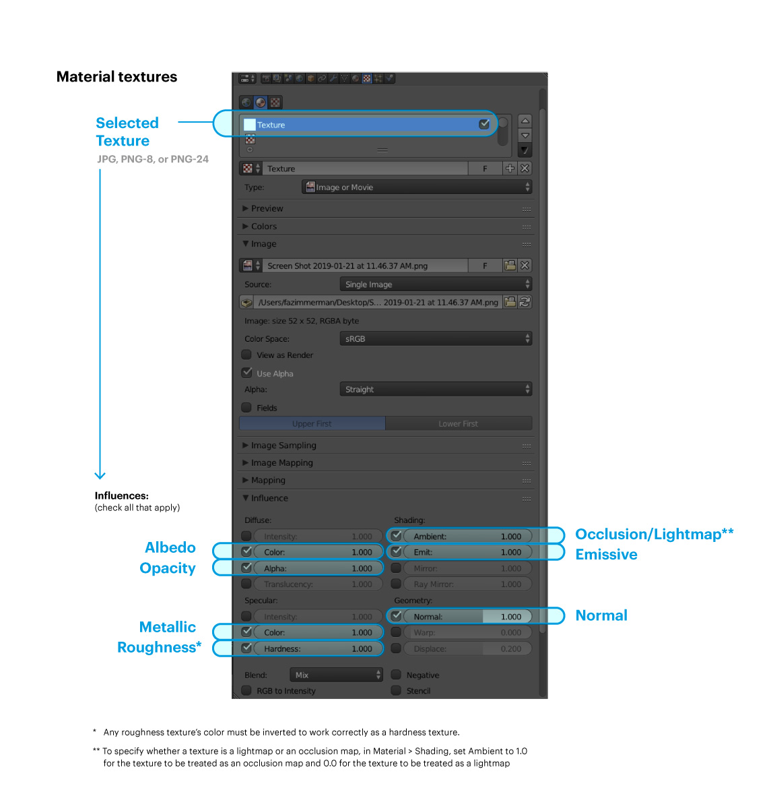
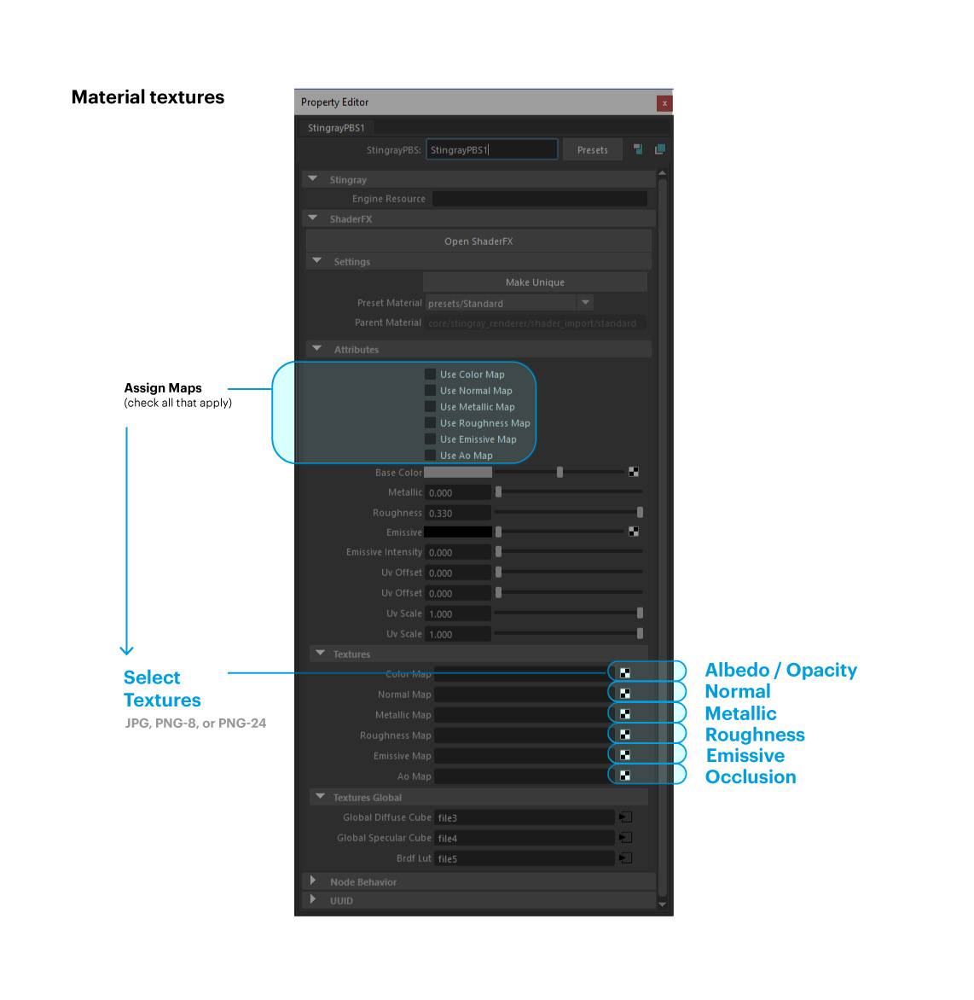

The appearance of a 3D model is controlled by its materials. The materials supported in High Fidelity are physically-based rendering (PBR) materials. This means that a 3D model's materials will reflect or absorb light like how they would (approximately) in real life.

**On This Page:**
+ [Introduction to Materials, Textures, and Shading](#introduction-to-materials-textures-and-shading)
  + [Textures](#textures)
  + [Shading](#shading)
    + [Material Channels](#material-channels)

+ [Sample Materials and Their Textures and Shading](#sample-materials-and-their-textures-and-shading)

+ [Set Material Values in Blender](#set-material-values-in-blender)

+ [Set Material Values in Maya](#set-material-values-in-maya)

  

## Introduction to Materials, Textures, and Shading

A 3D model's appearance is controlled by its materials. For example, a 3D model of a key will use a material that determines its color, how metallic it looks, and if its surface is bumpy or smooth. A 3D model of a brick wall will have material that determines its roughness and color.

High Fidelity supports physically-based rendering (PBR) materials. This means that your model will behave like a real world object when exposed to light. For example, the same 3D model of a key will shine and reflect any light that falls on it. The 3D model of a brick wall will not shine, but will reflect enough light for you to observe its colors and surface. 

A material contains texture and shading information.

### Textures
Textures are flat images that are applied to 3D models. These add detail on how a 3D model's material looks. For example, a 3D model of a tree trunk will use a texture of bark to show what the surface looks like.

High Fidelity supports textures in the PNG and JPEG formats.

### Shading
Since High Fidelity supports PBR materials, the shading used depicts an accurate representation of a how light interacts with different material surfaces. This means that your 3D model will not look the same under different light settings. The PBR shader has a set of material parameters or channels that can be modified to create different types of materials.

#### Material Channels
Material channels determine various parameters such as the roughness or color of a material. You can determine the value of each channel in two ways:
+ **Setting a Value:** The value of a channel is a value set on a slider. Setting a value is like turning off or turning on a switch. For example, if you look at your phone, some parts of it are shiny and some are matte. When you use a value, the entire object reflects that value. If you want different parts of an object to reflect varied roughness, you'll need to use a map.
+ **Using a Map:** The map is an image which you can import to define a property. You will use a map to apply a texture to your 3D model. For instance, your phone may have a case that is matte, but the rest of your phone is shiny. You can use a map to set the case as matte and the phone as shiny.

All materials in High Fidelity have the following channels that determine how they look:

| Channel Type  | Description                              | Value        | Map         |
| ------------- | ---------------------------------------- | ------------ | ----------- |
| Albedo        | This channel defines the material's color. You can pick any color value of your choice. | sRGB         | sRGB        |
| Metallic      | This channel determines if the material is metallic or not. You cannot have a material that is half metallic, it is either metallic or it isn't. | [0,1]        | [0,1]       |
| Roughness     | This determines how rough/matte or glossy/shiny an object is, using brightness levels. | [0,1]        | [0,1]       |
| Normal        | Normal is a channel that renders an object like there is actual geometry. For instance, normal would add bumps and other irregularities to a stone or ridges to a sea-shell. | xyz          | bump        |
| Opacity       | Opacity determines if an object is transparent or opaque. | [0,1]        | mask, alpha |
| Occlusion     | This property approximates the shading to be as natural as possible. This means that it will reproduce how objects interact with light. | ---          | [0, 1]      |
| Emissive      | This channel controls the amount of light being reflected from an object. | sRGB         | sRGB        |
| Scattering    | Scattering determines how light will behave when it hits human skin. This channel details how light is reflected or absorbed by human bodies. | [0,1]        | [0,1]       |
| Material Type | This channel decides if an object is lit or unlit. | [lit, unlit] | ---         |

Notes:
1. If you set transparency with a texture, the transparency (alpha) should be in the material’s albedo texture, as a PNG file with transparency and not as a separate transparency texture.
2. High Fidelity’s renderer can draw two different kinds of transparency: "alpha" (255 graduates steps of transparency, no shading on surface, casts no shadows,) and "mask" (binary transparency, full shading of opaque surface, whole surface casts shadow.)
3. To determine whether a texture is treated as a mask or as alpha, the engine looks for alpha values between 2% and 98%. An easy way to create a mask texture is to save your image as a PNG-8 since it only supports binary transparency, while PNG-24 supports a range of transparency levels.

## Sample Materials and Their Textures and Shading

High Fidelity supports different types of materials. We've created sample objects with each material type. You can download each object from [this repository](https://github.com/highfidelity/hifi_tests/tree/master/assets/models/material_matrix_models/fbx/blender) on GitHub, or run [this script](https://raw.githubusercontent.com/highfidelity/hifi_tests/master/assets/models/material_matrix_models/material_matrix.js) in High Fidelity to upload all sample objects in your domain.

We've listed all material information (including textures, shading, and channel values and maps) for these sample objects [here](https://docs.google.com/spreadsheets/d/e/2PACX-1vRsPXURPsIYV_LeEz1A7IS-t44qdTMtbrq-gZ47BAoxhd0kLs_Yxh-i1G4Ukz-aunTj-nLVF7sjZd1n/pubhtml?gid=0&single=true).

## Set Material Values in Blender

When you create a model in Blender, you have to export it in the FBX format to use in High Fidelity. Additionally, you have to modify material properties and textures in Blender to match the PBR material textures in High Fidelity. 

Doing so ensures that your model appears like how you want it to. 

By default, any material property set with a texture will override a property set with a value. The only exception to this is in the case of the albedo color set with an RGB color value and a texture, in which case the albedo value and texture will multiplied together. 

We've included images where the fields corresponding to each supported PBR channel in Blender are highlighted, along with details about which values and colors correspond to the range corresponding with that channel.  It should be noted that all of the Blender material properties below only relate to exported FBX format models. Models exported as OBJ or other formats do not have full PBR material support in High Fidelity yet.

 

## Set Material Values in Maya

Use the graphics below to set the right material values and textures in Maya. 

**See Also**

+ [Add a Material Entity](../../entities/material-entity)
+ [Load and Run a Script](../../../script/get-started-with-scripting#load-and-run-a-script)