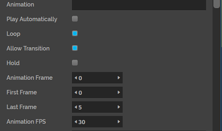

Enrich your High Fidelity experience by having 3D models in your domain with animations. For example, you can import the 3D model of a flag that appears to flutter with the wind.  

**On This Page:**

+ [Prerequisites](#prerequisites)
+ [Prepare a 3D Model Animation](#prepare-a-3d-model-animation)
+ [Import an Animation](#import-an-animation)

## Prerequisites

You need to be familiar with creating animations in 3D modeling tools such as Blender and Maya before going importing an animation into High Fidelity.

## Prepare a 3D Model Animation

Before you import an animation into High Fidelity, adjust some settings in the 3D modeling tool of your choice to ensure that it plays smoothly.

1. Set the framerate to 30 fps for the best results (our recommendation).  
2. Bake your animation channels, key frames, and inbetweens to ensure that High Fidelity reads everything. This is to ensure that your animation doesn't stop and start, but appears smooth and flows through each movement.
3. Prepare to export the skeleton and frames that are being used in the animation. 
4. Export your animation as an FBX file. 
5. Upload this FBX file to a cloud server. Copy the URL. 

## Import an Animation

Once you complete uploading your animation's FBX file, you can import the 3D model and it's animation into High Fidelity.

1. In Interface, pull up your HUD or Tablet and go to **Create**.
2. Click on the 'MODEL' icon and enter your 3D model's URL. This is different from your animation's URL.
3. In the 'Properties' tab, scroll down to 'Animation' and paste the animation's URL. 
4. You can edit the following animation properties:

   | Property                                     | Description |
   | -------------------------------------------- | ----------- |
   | Play Automatically | Enable this to play your animation automatically when uploaded. |
   | Loop | Select this property to play your animation in a continuous loop. |
   | Allow Transition | Enable this to let the animation move through space. This means that it won't only play rotationally, it will move through all three dimensions. |
   | Hold | Select to hold your animation at a particular frame. |
   | Animation Frame | Enter the frame at which you want to pause or hold your animation. |
   | First Frame | This is the first frame from when your want your animation to start. |
   | Last Frame | This is the last frame where you want your animation to stop. It will not play beyond this specified frame. |
   | Animation FPS | This is the animation's framerate. |

5. You can also control an animation's properties and when it starts playing with an [entity script](../../../script/client-entity-scripts). 

**See Also**

+ [Import Your 3D Model](../import-model)

  