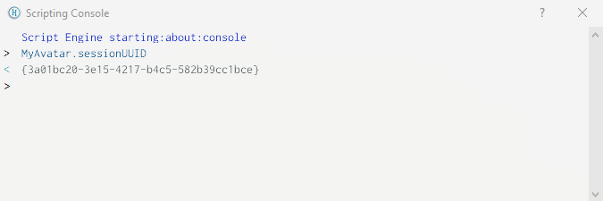
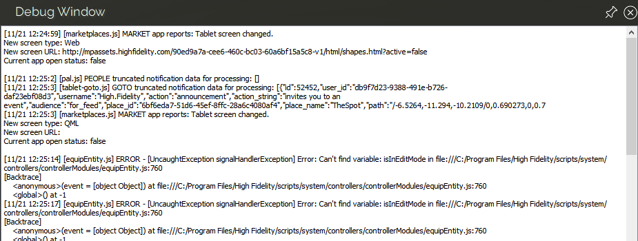

Many of the scripts in High Fidelity run behind the scenes, so that you don't even know they're running. However, if you want to create some advanced behavior, you may need to [write your own scripts](../write-scripts) to make sure everything works correctly. 

This page ensures that you know what type of script to use and helps you get started running your own simple scripts.

**On This Page:**
* [JavaScript Basics](#javascript-basics-in-high-fidelity)
* [Types of Scripts](#types-of-scripts) 
* [Scripting Permissions](#scripting-permissions)
* [Running Scripts Window](#running-scripts-window)
  * [Sample Scripts](#sample-scripts)
  * [Load and Run a Script](#load-and-run-a-script)
  * [Reload or Stop a Script](#reload-or-stop-a-script)
  * [Add a Script to the Default Scripts](#add-a-script-to-the-default-scripts)
* [Scripting Console](#scripting-console)
* [Debug Window](#debug-window)

## JavaScript Basics in High Fidelity
High Fidelity scripting runs on a JavaScript engine that is provided with Qt. 

>>>Note that any functionality that runs around web pages (such as cookies, local storages, or databases) does not work with 3D environments such as High Fidelity. For this reason, you cannot use JavaScript frameworks such as Angular, React, Express, jQuery, Vue, etc.

You are likely to interface most with these High Fidelity APIs:  

| API(s)  | Description  |
|---|---|
| [Entities](../../api-reference/namespaces/entities)  | Lets you manipulate the entities around you, as long as you have permissions to do so. This means you can add, remove, and edit entities. Everyone has access to `get` properties of an entity, and can be used to find Entities in range, direction, collision, or raytrace. |
| [AvatarList](../../api-reference/namespaces/avatarlist) [AvatarManager](../../api-reference/namespaces/avatarmanager) [MyAvatar](../../api-reference/namespaces/myavatar)  | Lets you get information on an [Avatar](../../api-reference/namespaces/avatar), or manipulate your own client-only [MyAvatar](../../api-reference/namespaces/myavatar). The information here will be always the avatar information of the client running the script. AvatarList and AvatarManager are basically the same. |
| [Script](../../api-reference/namespaces/script)  | Lets you to connect callbacks from your client to script, such as functionality that is dependent on time (Script.update, Script.setTime, Script.setInterval etc), connect paths relatively to Assets (Script.relativePath), refer to other scripts (Script.include), or create events which occur when the script is turned off (Script.scriptEnding). |

There are [many other APIs available](../../api-reference), and we encourage you to make sure use of them as you become more comfortable scripting in High Fidelity.

## Types of Scripts

| Script Type  | Description  |
|---|---|
| Interface Script  | *Interface scripts* run as long as you have Interface running. With these scripts, you can perform one-time creation tasks or modify the user experience with new menus, overlays, tweaks, plugins, and extensions. |
| Assignment Client Script  | *Assignment client scripts* coordinate the actions between entities and avatars in your domain. These scripts continue to run even when you shut down Interface.  |
| Avatar Script  | *Avatar scripts* run on an avatar and can give it unique effects, such as flowing hair.  |
| Client Entity Script  | *Client entity scripts* are scripts attached to entities that run locally in response to a user in a domain. With these scripts, you can customize what happens when a user encounters an entity.  |
| Server Entity Script  | *Server entity scripts* are scripts attached to entities that do not require a user to trigger. These scripts control entities so that their behavior is seen and heard by everyone in the domain.  |

## Scripting Permissions
Each domain owner has the ability to [restrict create and edit permissions](../../host/your-domain/secure-domain). If the script you want to run adds or edits entities and you don't have the permission to do so, you won't see any objects created or changed. However, you will still see the script listed in the Running Scripts window. 

## Running Scripts Window
The Running Scripts window can be used to load, run and stop scripts from a URL or from a disk drive. High Fidelity also provides a number of sample scripts for you to try out. 

To open the 'Running Scripts' window, go to **Edit > Running Scripts** or press <kbd class="keyboard">Ctrl</kbd> + <kbd class="keyboard">J</kbd> on your keyboard.

### Sample Scripts

High Fidelity comes with a collection of scripts designed to improve your experience as a user and provide tools for developing your own content. We encourage you to look at these scripts as a resource to learn how to code your own. 

>>>>>Loading (or running) a script lets you test the functionality and see how it behaves. If you want to view the actual code, you will need to open the file in the text editor of your choice. In the Running Scripts window, click Reveal Scripts Folder and browse to the JS file that you want to view. 

These are the scripts we have available:  

| Scripts Folder  | Description  |
|---|---|
| `+android`  | These scripts were built to run on Android devices.  |
| `developer`  | These scripts were created for internal use and debugging, but are available as advanced developers may find them useful when creating content. These scripts are not "entry-level" and are not guaranteed to work or be documented.  |
| `modules`  | These scripts create external tools that simplify scripting in High Fidelity. For example, the AppUI module helps you create a tablet app, while the Request module processes HTTP requests.   |
| `system`  | These scripts are critical to the stability and usability of High Fidelity. Making changes to these scripts is not recommended, nor is it easy, as you may need 'administrative' privileges.   |
| `tutorials`  | These scripts provide examples of what you can do using scripts in High Fidelity. Examples include: creating butterflies, making your avatar clap, and adding ambient sound to your domain.  |

### Load and Run a Script
To run a script: 
1. Open the 'Running Scripts' window. 
2. For scripts hosted in the cloud, click 'From URL'. Enter the URL of your script file and click 'OK'.
3. For scripts on your local computer, click 'From Disk'. Browse to your script file and click 'Open'.
4. To load a sample script, browse to the script at the bottom of the 'Running Scripts' window. 

### Reload or Stop a Script
To reload or stop a script, open the 'Running Scripts' window and do one of the following:

* To reload all running scripts, click the 'Reload All' button at the top of the 'Running Scripts' window.
* To reload a specific script, click the circular arrow next to the script.
* To stop all running scripts, click the 'Stop All' button at the top of the 'Running Scripts' window.
* To stop a specific script, click the 'X' next to the script.

### Add a Script to the Default Scripts

You can add a script to the default scripts, to run every time you start Interface. 

* In Interface, pull up your Tablet or HUD and go to **Menu > Edit > Running Scripts**.
* Click 'Reveal Scripts Folder' at the bottom. 
* In the file explorer window, open the 'defaultScripts.js' file. 
* Add your script to this file to make it run with other default scripts. Ensure the folder path to your script is correct.

>>>>> The 'defaultScripts.js' file is updated every time you update Interface to the latest release version. This means that any changes you make to the file will be overwritten. You can avoid this by writing and running a 'loader' script to load scripts on start up. 

## Scripting Console 

The Scripting Console lets you test and run short script snippets quickly in High Fidelity to see how they work. To open the console, go to the 'Developer menu', then **Scripting > Console**. If the 'Developer' menu is not visible, first go to the 'Settings' menu and click 'Developer' Menu.

## Debug Window
The Debug Window shows the output generated by your running scripts. This lets you watch the script(s) in action and make sure that it is running as you intended. If the script fails, the debugger can help you identify what went wrong, and point you to specific lines of code where the error occurred. To open the Debug Window, go to the 'Developer' menu, then **Scripting > Script Log** (HMD Friendly). If the Developer menu is not visible, first go to the 'Settings' menu and click 'Developer' Menu.

**See Also**

+ [Interface Scripts](../interface-scripts)
+ [Assignment Client Scripts](../assignment-client-scripts)
+ [Avatar Scripts](../avatar-scripts)
+ [Client Entity Scripts](../client-entity-scripts)
+ [Server Entity Scripts](../server-entity-scripts)
+ [Write Your Own Scripts](../write-scripts)