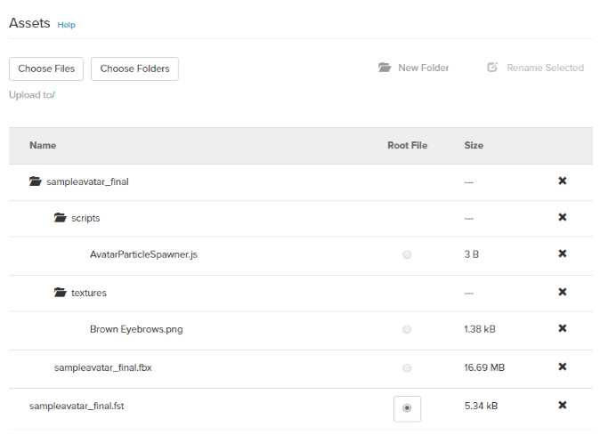
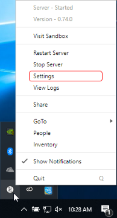
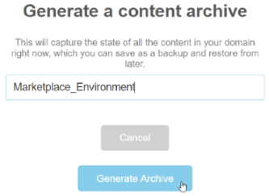

Once you've created an avatar, wearable or entity, you have the option to sell it in the Marketplace. This guide walks you through the steps to upload it to the Marketplace so that you can start the process of having it reviewed and published. 

+ [Add Your 3D Model](#add-your-3d-model)
  + [Add Your FBX File](#add-your-fbx-file)
  + [Generate Your Item's JSON File](#generate-your-items-json-file)

+ [Add Your Avatar](#add-your-avatar)
  + [Add Your Avatar's Files](#add-your-avatars-files)
  + [Find Your Avatar's URL](#find-your-avatars-url)

+ [Upload Your Environment](#upload-your-environment)

## Add Your 3D Model

Once you've created your 3D model, you need to add the item and its assets in the Marketplace.

 ### Prepare Your FBX File

1. Export your file as an FBX file from your 3D modeling program. Do not export it as a default file type such as .mb or .blend. 
2. If supported by your 3D modeling software, embed your textures into your FBX file to keep the process simpler.
3. As a practice and to catch any errors, re-import your FBX back into a new scene and check that it still looks right. Look for things like missing textures or normals, and smoothing issues. You may need to tweak your export settings if the re-imported model does not look right.
4. If your model could be re-imported without any issues, it is now ready to be uploaded to High Fidelity. Go to [https://highfidelity.com/marketplace/items/new](https://highfidelity.com/marketplace/items/new) to create a new item. If you're not logged in, you will be prompted to do so. Create a new Marketplace item or edit the one you have already created.
5. Upload your new FBX file under "Assets". You can find this file in the uploaded files section. Click to copy the new Marketplace URL for the FBX file. If your item contains multiples files like scripts or textures, make sure you upload all of them. You can upload an entire directory using "Choose Folders", if required. 

### Generate Your Item's JSON File

1. In Interface, go to **Create** and click on the Model icon to Import your file into High Fidelity. Use the URL you copied in step 5. You can only do this in a domain where you have the permission to add an entity.
2. Once your model appears before your avatar, check it and make any adjustments needed. Look for missing textures or normals, smoothing issues, issues with the scale of the model, and rotation problems. Make any changes in your 3D modeling software. Once your model looks as expected in High Fidelity, you are now ready to export your model data into a JSON file. Keep in mind that different types of software render models differently.
3. In Interface, go to **Create** and select your model in the **Entity List**. Select all files associated with your item and click "Export Selection". This will save your item data as a JSON file. 
4. This JSON file just contains information on how High Fidelity can access your item and its files, and needs to contain a reference to your item's location. Open your JSON file in a text editor and check if the variable `modelURL` contains your FBX file's Marketplace URL. If it doesn't, you can edit it and paste the correct URL. 
5. In Interface, go to **Create** and click "Import Entities (.JSON)" to import your JSON file. Check if your item looks fine. 
6. Go to [https://highfidelity.com/marketplace](https://highfidelity.com/marketplace) to continue editing your item. Upload your JSON item under "Assets". Make sure it is the 'Root' file'. 
7. You have now successfully uploaded content! Fill out the rest of the metadata and send it in for approval and certification.

## Add Your Avatar

Once you [create an avatar](../create-and-explore/avatars/create-avatars), it should contain the following files:
* An FST file
* An FBX file
* Scripts folder (optional)
* Textures folder

You will need to upload all these files to the Marketplace. 

### Add Your Avatar's Files

1. Go to [https://highfidelity.com/marketplace/items/new](https://highfidelity.com/marketplace/items/new) to create a new item. If you're not logged in, you will be prompted to do so.
2. Enter your avatar's name and select your category as 'Avatars'. You can add the metadata now or later. 
3. Click 'Save Draft'. 
4. Scroll down to the Assets section. 
5. Click 'Choose Folder' and navigate to where your avatar is saved on your computer. Select the folder that contains your FBX file, click 'Upload' twice and wait for it to upload.
6. Click on the uploaded FBX file, and copy the Marketplace path including the unique hash for your avatar. Do not copy your folder name or the name of the file. 
7. Open your FST file in the text editor of your choice. (Note that the FST file is a local file on your computer)
8. Locate the relative path references to the FBX file, textures directory, and script file(s). Replace these with the absolute path references of the uploaded content. 
9. Return to your avatar submission on the Marketplace. 
10. In the Assets section, click 'Choose Files' and navigate to where your avatar is saved on your computer. Select your updated FST file, click 'Open' and wait for it to upload.
>>>>>Be sure you do not have any files or folders selected in the asset viewer so that the uploaded file goes to the right place. Any selected files and folders will be highlighted blue.
>>>>>
>>>>>12. Click the FST file as your root file in the Asset Viewer.  
13. Save your submission. 

### Find Your Avatar's URL

Now you are ready to use your avatar! To locate the URL for your avatar:

1. Go to [https://highfidelity.com/marketplace](https://highfidelity.com/marketplace). If you're not logged in, you will be prompted to do so.
2. Click on your user name, then on 'My Items'.
3. Locate your avatar in Draft mode and click on it. 
4. Click 'Edit'.
5. Scroll down to the Assets section.
6. Click on the FST file. Below it, click the 'Copy URL' button.

This is the URL you will use when you [change your avatar](../change-avatar) in High Fidelity.

If you wish to sell your avatar on the Marketplace, be sure to fill out your metadata and click "Submit for Review" to be verified and certified on the Marketplace.

## Upload Your Environment

Before uploading your environment to the Marketplace, make sure that you created the environment in a domain where you have access to the administration panel. Keep in mind that _all_ content in the domain will be included in your upload. Once your domain is set up, you are ready to upload your environment.

1. Open your Domain Administration Panel. If you are on a local sandbox, open it by clicking on the High Fidelity icon in the taskbar notifications and click Settings. 
2. Click on Content.
3. In the Content Archives section, click Generate New Archive.
4. Enter a name for your archive and click Generate Archive. It will appear just below the Generate New Archive button. 
5. Click the Actions button, then select Download. 
6. Go to [https://highfidelity.com/marketplace/items/new](https://highfidelity.com/marketplace/items/new) to create a new item. If you're not logged in, you will be prompted to do so.
7. Enter a name for your environment.
8. Under Categories, select 'Environments'.
9. Click 'Save Draft'. 
10. Scroll down to the Assets section. 
11. Click 'Choose Files' and navigate to where your environment download is saved on your computer. Select the ZIP file, click 'Open' and wait for it to upload.
12. Save your submission.

If you wish to sell your environment on the Marketplace, be sure to fill out your metadata and click "Submit for Review" to be verified and certified on the Marketplace.

## Notes

1. Use only content which you are legally entitled to.
2. Do not use a code obfuscator, our review team needs to be able to read your scripts.
3. Audio should sound clean and be 32 bit, 48 khz wav files.
4. If your item is an object that must be rezzed by a script, attach that script to a dummy object, export it as a .JSON and use that as your main file.
5. All entities must have a name, even if they are invisible or simple primitives.
6. Please use English in your package description, support text, and code comments.
7. If needed, you may use HTML tags in your description text.
8. We recommend to link to your website, email, social media or other resource.

